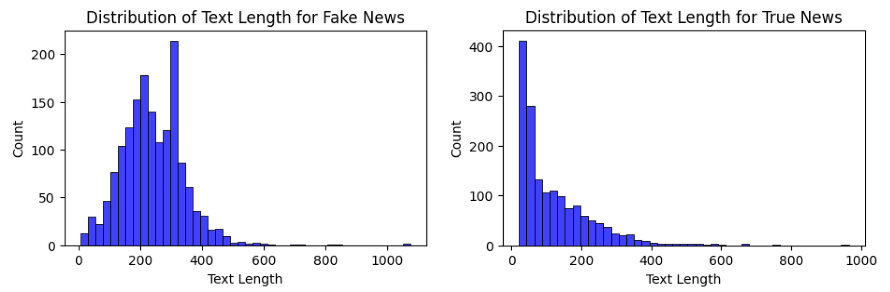
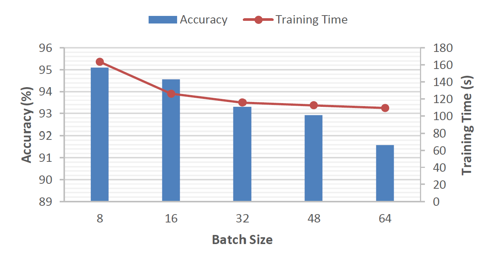
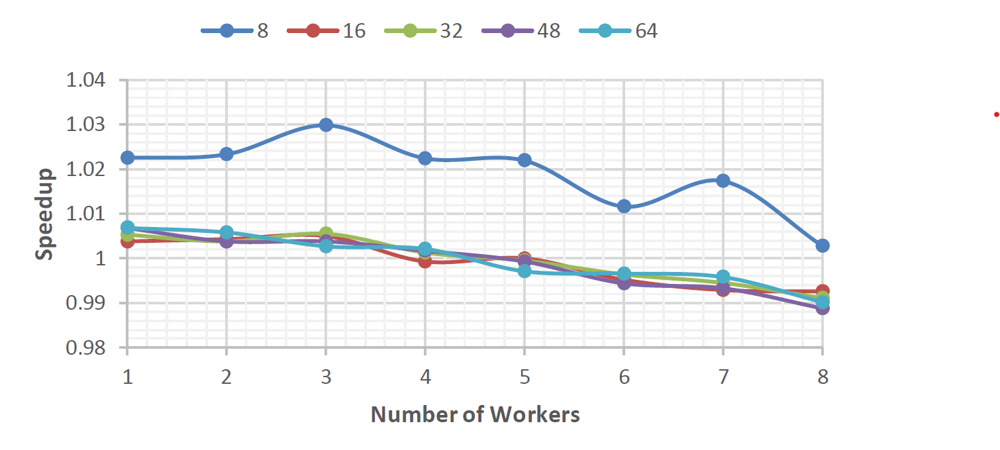
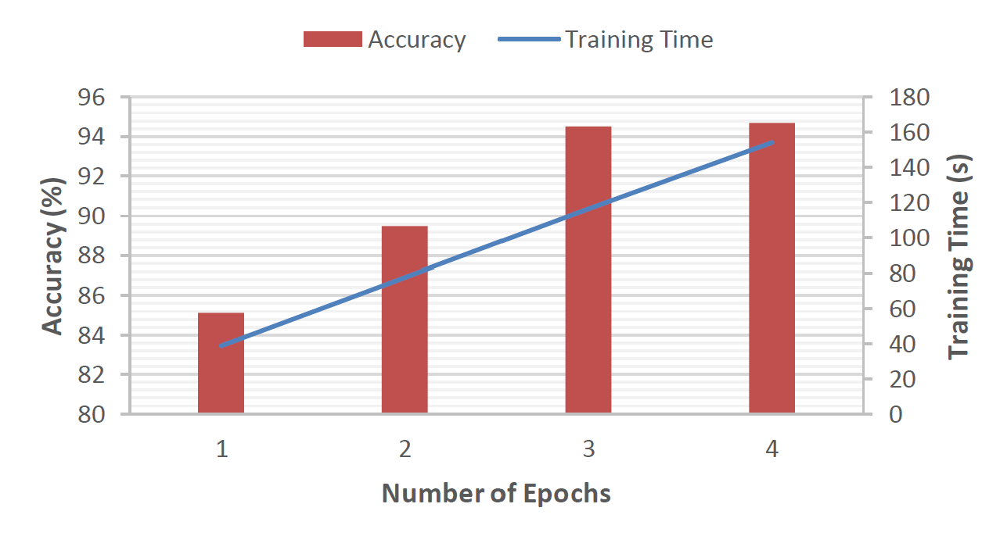
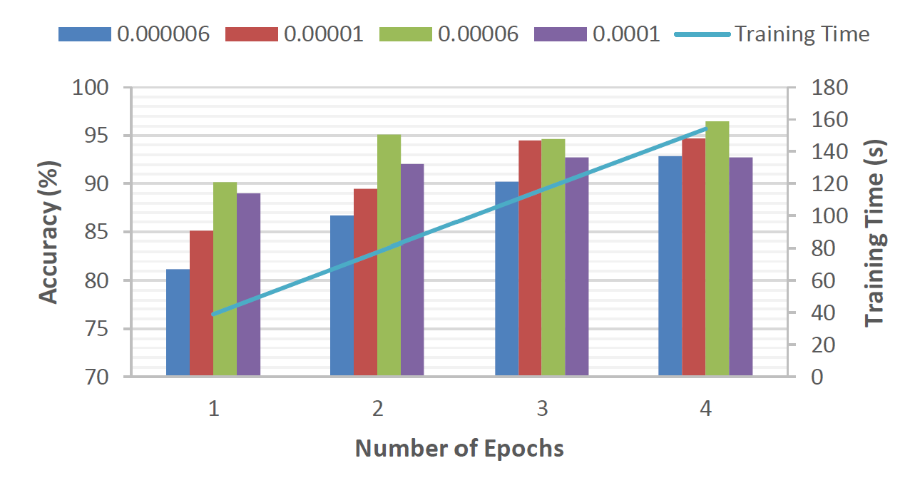

# GPU-Accelerated-BERT-for-Fake-News-Detection-in-Filipino

### 📌 Project Overview
This project explores the parallelization of GPUs for optimizing a BERT-based fake news detection model in the Filipino language. Given the computationally intensive nature of transformer models, GPU acceleration was leveraged to improve training efficiency and model performance.

🔗 Research Paper 

### 🚀 Key Highlights
- GPU Utilization: Used NVIDIA-L4 with CUDA version 12.2 in Google Colab to parallelize training.
- Dataset: 1,603 Filipino news articles (fake and true) from Hugging Face.
- Model: BERT-based transformer fine-tuned for fake news classification.
- Performance Optimization:
  - Batch Size: 32 (optimal for speed vs. accuracy tradeoff)
  - Data Loaders: 2 workers for parallel data loading
  - Learning Rate: 0.00006
  - Epochs: 2 (to prevent overfitting)
- Results:
  - 94.39% accuracy
  - 76.26s per epoch (efficient training time)

### 🏭 Data Sources
The dataset consists of 1,603 news articles in Filipino:
- 801 labeled as fake news
- 802 labeled as true news
Dataset Features:
- text: The full news article in Filipino
- label:	0 = True News, 1 = Fake News
Text Length Distribution:
- Fake news articles have shorter text lengths on average compared to true news.
- The mean text length:
  - Fake News: ~121 words
  - True News: ~244 words
Source: [HuggingFace](https://huggingface.co/datasets/jcblaise/fake_news_filipino)

#### Word Cloud
Below are the most frequent words in fake and true news articles (excluding stop words):

 
   

#### Text Length Distribution
Fake news articles tend to be shorter than true news articles.

 
   

### 📊 Performance Analysis
#### 📌 Impact of Batch Size

Batch size refers to the number of samples processed by GPU. Note that tensor core requirements define the optimal batch size. Given that the model was trained on a 16-bit floating point precision in NVIDIA-L4 with CUDA version 12.2, the batch size set was decided to be multiples of 8. 

 
   

Larger batch size shortens the training time because it improves gradient estimation, leading to faster convergence. However, this may lead to poorer generalization due to reduced noise in gradient estimation, leading to a lower model accuracy.

#### 📌 Speedup with Multiple Data Loaders
In data loading, multiple workers can load a batch of data in parallel. Hence while the model is processing a batch, other workers can load the next batch.

 
   

More workers speed up the data loading and reduce the time the model waits for the data. This is observed until the number of workers was set to 4. Beyond that, the GPU is already utilized to its maximum capacity and no further speedup can be observed, leading only to an increase in memory usage.

#### 📌 Impact of Epochs
An epoch entails a complete pass through the training dataset. With every epoch, the model parameters are updated based on the data where fewer epochs increase the risk of underfitting while more epochs increase the risk of overfitting. Hence, finding the number of epochs that balances model accuracy and training time is necessary.

 
   

Model accuracy increases until 3 and 4 epochs, where the model has reached a bottleneck. On the other hand, training time increases linearly with the number of epochs. From this figure, 3 training epochs are optimal.

#### 📌 Impact of Learning Rate

The learning rate controls the step size of the model optimization. It affects the precision of convergence where lower learning rates lead to slower convergence, longer training time, and a higher risk of getting stuck in the local minima, meanwhile, higher learning rates lead to faster convergence, shorter training time, and a higher risk of overshooting the local minima. Typically, higher learning rates require fewer training epochs.

 
   

We chose an optimal learning rate with the right number of epochs considering model accuracy and training time. Note that for this study, the training time of varying learning rates is close and averages to the training time that linearly increases with the number of epochs. Based on this figure, the optimal learning rate is 0.00006 with 2 training epochs.

#### 📌 Optimal Performance Metrics

The optimal BERT-based fake news detection model that ran on an NVIDIA-L4 GPU with the Filipino dataset has a batch size of 32 with 2 data loaders, and a learning rate of 0.00006 with 2 training epochs.

  
| Metric            | Score          | 
|-------------------|----------------|
| Training Time (s) | 76.26          | 
| Accuracy          | 0.9439         |
| F1 Score          | 0.9440         | 
| Precision         | 0.9417         | 
| Recall            | 0.9463         | 
| Validation Loss   | 0.1645         | 

### 📜 Future Work
- Implement gradient accumulation & checkpointing for memory efficiency.
- Explore distributed training across multiple GPUs.
- Optimizer/Fine-tuner choice to enhance model performance
- Real-time deployment. 
